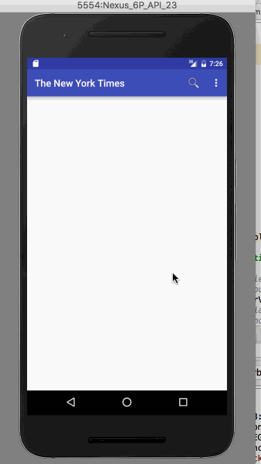

# The New York Times Search App

It helps a user to search for articles by acccessing NY times Search API.

Time spent: **14** hours spent in total

## User Stories

The following **required** user stories are completed:

*  User can enter a search query that will display a grid of news articles using the thumbnail and headline from the New York Times Search API.
* User can click on "filter" icon which allows selection of advanced search options to filter articles. (3 points)
  An example of a query with filters (begin_date, sort, and news_desk) applied can be found here. Full details of the API can be found on this article search README.
* User can configure advanced search filters such as: (points included above)
    Begin Date (using a date picker)
    Sort order (oldest or newest) using a spinner dropdown
    News desk values (Arts, Fashion & Style, Sports) using checkboxes
* Subsequent searches will have any filters applied to the search results. (1 point)
* User can tap on any article in results to view the contents in an embedded browser. (2 points)
* User can scroll down "infinitely" to continue loading more news articles. The maximum number of articles is limited by the API search.

The following optional user stories are implemented:

* Robust error handling, check if internet is available, handle error cases, network failures. 
* Use the ActionBar SearchView or custom layout as the query box instead of an EditText.
* User can share a link to their friends or email it to themselves
* User can share a link to their friends or email it to themselves.
* Improve the user interface and experiment with image assets and/or styling and coloring

The following Stretch user stories are implemented:

* Replace Picasso with Glide for more efficient image rendering
* Leverage the popular GSON library to streamline the parsing of JSON data

* Also have added an icon to the app

## Video Walkthrough

Here's a walkthrough of implemented user stories:

I could not show the Share functionality on the emulator. So took a video of Share functonality and uploaded it to *IMG_2096.MOV*.
